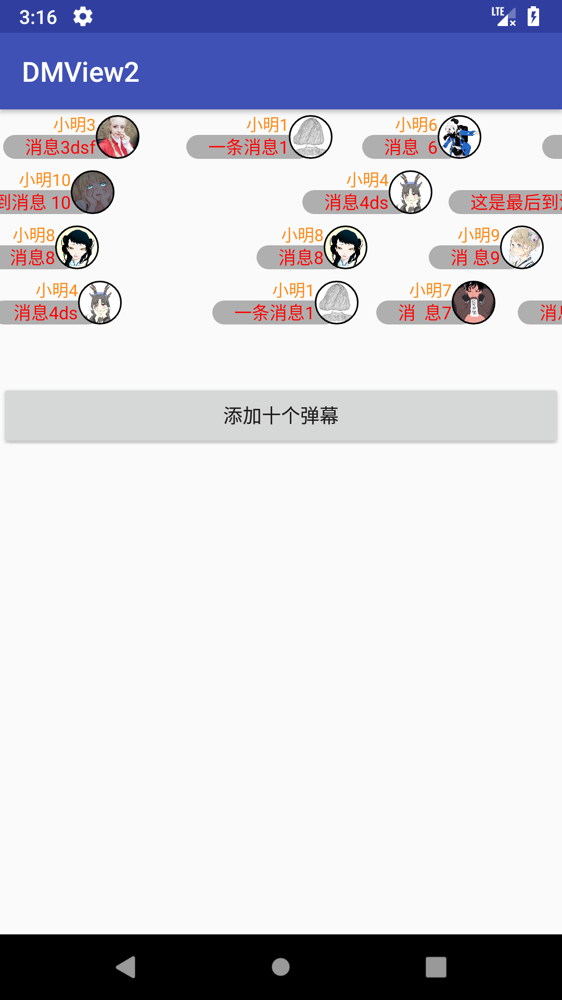
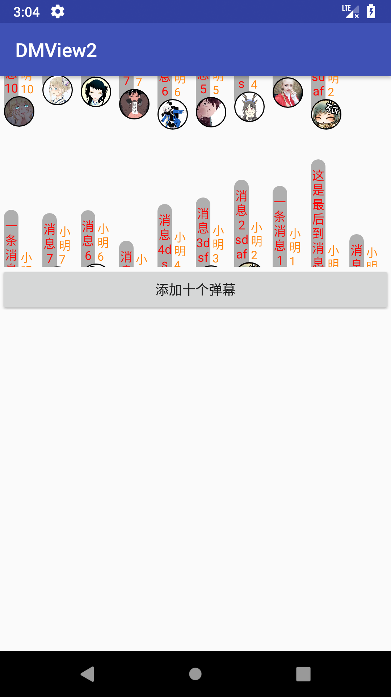
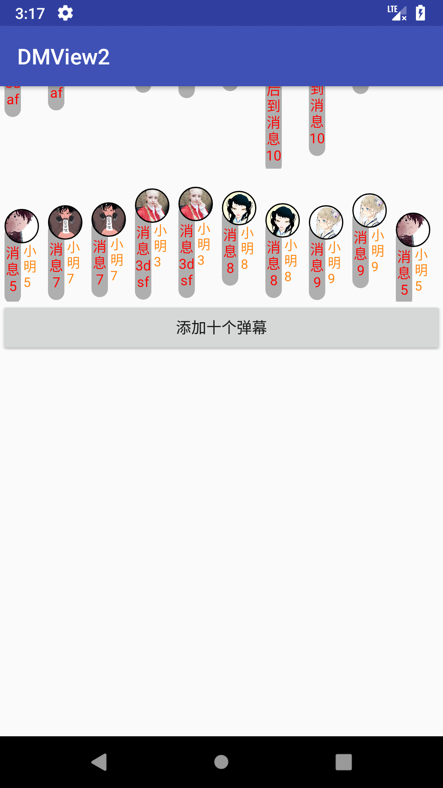

# DMView2
# 新版本建造中...

> 弹幕对照表

|从右往左|从左往右|从上往下|从下往上|
|-|-|-|-|
|||||
|`direction="right_left"`|`direction="left_right"`|`direction="up_down"`|`direction="down_up"`|

# 如何使用？
## 步骤1
> 在布局xml文件中添加，如下：

``` xml
<?xml version="1.0" encoding="utf-8"?>
<LinearLayout
    xmlns:android="http://schemas.android.com/apk/res/android"
    xmlns:tools="http://schemas.android.com/tools"
    xmlns:app="http://schemas.android.com/apk/res-auto"
    android:layout_width="match_parent"
    android:layout_height="match_parent"
    android:orientation="vertical"
    tools:context="com.xujiaji.dmview2.MainActivity">

    <com.xujiaji.dmlib2.DMSurfaceView
        android:id="@+id/dmView"
        android:layout_width="match_parent"
        app:direction="down_up"
        android:layout_height="200dp" />

    <Button
        android:layout_width="match_parent"
        android:layout_height="wrap_content"
        android:onClick="onClickAddDM"
        android:text="添加十个弹幕"/>
</LinearLayout>
```

## 步骤2
> 创建弹幕模板布局，例如：

``` xml
<FrameLayout xmlns:android="http://schemas.android.com/apk/res/android"
    xmlns:app="http://schemas.android.com/apk/res-auto"
    android:id="@+id/layout"
    android:layout_width="wrap_content"
    android:layout_height="@dimen/head_size"
    android:layout_marginTop="2dp"
    android:padding="4dp"
    android:layout_marginBottom="2dp">


    <TextView
        android:id="@+id/tvBarrageName"
        android:layout_width="wrap_content"
        android:layout_height="wrap_content"
        android:layout_marginLeft="32dp"
        android:layout_marginStart="32dp"
        android:layout_marginBottom="2dp"
        android:padding="0dp"
        android:includeFontPadding="false"
        android:text="test"
        android:textColor="#ff8813"
        android:textSize="12sp" />

    <TextView
        android:id="@+id/tvBarrageMsg"
        android:layout_width="wrap_content"
        android:layout_height="wrap_content"
        android:layout_marginLeft="16dp"
        android:background="@drawable/shape_barrage_bg"
        android:paddingLeft="16dp"
        android:paddingStart="16dp"
        android:paddingRight="16dp"
        android:paddingEnd="16dp"
        android:textColor="#ff0000"
        android:text="sdafjlsaj"
        android:layout_gravity="bottom"
        android:textSize="13sp" />

    <de.hdodenhof.circleimageview.CircleImageView
        android:id="@+id/imgBarrageHead"
        android:layout_width="@dimen/head_size"
        android:layout_height="@dimen/head_size"
        android:src="@drawable/boy_head"
        app:civ_border_width="1dp"
        app:civ_border_color="#FF000000"/>
</FrameLayout>
```

## 步骤3
> 获取DMSurfaceView实例，通过add方法添加弹幕，弹幕为步骤2设置好数据的模板。详细代码如下；

``` java
public class MainActivity extends AppCompatActivity {

    private DMSurfaceView dmSurfaceView;
    @Override
    protected void onCreate(Bundle savedInstanceState) {
        super.onCreate(savedInstanceState);
        setContentView(R.layout.activity_main);
        dmSurfaceView = findViewById(R.id.dmView);
    }

    public void onClickAddDM(View view)
    {
        addDM("小明1", "一条消息1", "https://ss0.bdstatic.com/70cFuHSh_Q1YnxGkpoWK1HF6hhy/it/u=3512331237,2033775251&fm=27&gp=0.jpg");
        addDM("小明2", "消息2 sdaf", "https://ss0.bdstatic.com/70cFvHSh_Q1YnxGkpoWK1HF6hhy/it/u=1881776517,987084327&fm=27&gp=0.jpg");
        addDM("小明3", "消息3dsf", "https://ss0.bdstatic.com/70cFuHSh_Q1YnxGkpoWK1HF6hhy/it/u=16550438,2220103346&fm=27&gp=0.jpg");
        addDM("小明4", "消息4ds", "https://ss0.bdstatic.com/70cFuHSh_Q1YnxGkpoWK1HF6hhy/it/u=2237097328,2363045038&fm=27&gp=0.jpg");
        addDM("小明5", "消息5", "https://ss0.bdstatic.com/70cFuHSh_Q1YnxGkpoWK1HF6hhy/it/u=586574978,3261086036&fm=27&gp=0.jpg");

        addDM("小明6", "消息  6", "https://ss2.bdstatic.com/70cFvnSh_Q1YnxGkpoWK1HF6hhy/it/u=3185942390,3143936596&fm=27&gp=0.jpg");
        addDM("小明7", "消  息7", "https://ss0.bdstatic.com/70cFuHSh_Q1YnxGkpoWK1HF6hhy/it/u=1137298932,366992998&fm=27&gp=0.jpg");
        addDM("小明8", "消息8", "https://ss1.bdstatic.com/70cFuXSh_Q1YnxGkpoWK1HF6hhy/it/u=1727532235,3210820490&fm=27&gp=0.jpg");
        addDM("小明9", "消 息9", "https://ss2.bdstatic.com/70cFvnSh_Q1YnxGkpoWK1HF6hhy/it/u=782046930,1105099424&fm=27&gp=0.jpg");
        addDM("小明10", "这是最后到消息 10", "https://ss3.bdstatic.com/70cFv8Sh_Q1YnxGkpoWK1HF6hhy/it/u=73760354,2094376027&fm=27&gp=0.jpg");
    }

    private void addDM(String name, String msg, String imgUrl)
    {
        final View templateView = LayoutInflater.from(this).inflate(R.layout.barrage_down_up, null);
        final ViewHolder mViewHolder = new ViewHolder(templateView);
        mViewHolder.tvBarrageName.setText(name);
        mViewHolder.tvBarrageMsg.setText(msg);
//        mViewHolder.imgBarrageHead.setImageBitmap(bitmap);
        Glide.with(this)
                .load(imgUrl)
                .into(new SimpleTarget<Drawable>()
                {
                    @Override
                    public void onResourceReady(@NonNull Drawable resource, @Nullable Transition<? super Drawable> transition)
                    {
                        mViewHolder.imgBarrageHead.setImageDrawable(resource);
                        dmSurfaceView.add(templateView);
                    }
                });
    }

    private static class ViewHolder
    {
        TextView tvBarrageName;
        TextView tvBarrageMsg;
        ImageView imgBarrageHead;

        ViewHolder(View view)
        {
            tvBarrageName = view.findViewById(R.id.tvBarrageName);
            tvBarrageMsg = view.findViewById(R.id.tvBarrageMsg);
            imgBarrageHead = view.findViewById(R.id.imgBarrageHead);
        }
    }
}
```