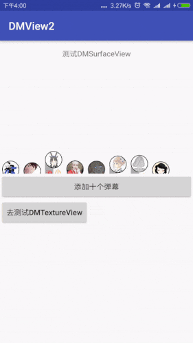

# DMView2
[](https://bintray.com/xujiaji/maven/dmlib2/0.0.6)
# 介绍
该项目是为了弃用[DMView](https://github.com/xujiaji/DMView)，因为当时刚刚进入实习用RecyclerView动画实现的，性能很差。后来我离职后又再也没管了，不过有很多朋友又使用了`DMView`，本着写出来就要负责的态度，于是写了这个续集。

1. `DMView2`不是单纯的只有文字的弹幕，可图文一起；
2. `DMView2`目前通过两种方式实现，`SurfaceView`和`TextureView`。大家在使用的时候可以自行选择；
3. `DMView2`只是展示您设置好的View模板，模板可通过写xml布局，并且可以同时添加多种模板；
4. 如果是视频弹幕的话那么建议用bilibili开源的弹幕更好点；
5. 本库适合轻量级弹幕，弹幕样式高度自定义（你可以理解为该框架就是个展示传输带，你把要展示的图片扔上去就行了）
6. *该类库还可以用来展示动态的公告消息*

# 测试效果演示



# 方法参照表

|xml参数|值|作用|
|:-|-|:-|
|`dm_direction`|`right_left`、`left_right`<br>`up_down`、`down_up`|`down_up`：弹幕从下往上跑；<br>`up_down`：弹幕从上往下跑；<br>`left_right`：弹幕从左往右跑；<br>`right_left`：弹幕从右往左跑|
|`dm_span`|`dp`|刷新一次界面弹幕所移动的跨度|
|`dm_sleep`|`int`|每次刷新需要睡眠多久，单位：ms（毫秒）|
|`dm_v_space`|`dp`|弹幕之间的垂直方向间距|
|`dm_h_space`|`dp`|弹幕之间的横向间距|

注意： `dm_span`和`dm_sleep`可配合使用，调整弹幕运动速度

# 添加依赖
> build.gradle文件中添加依赖

```
implementation 'com.github.xujiaji:dmlib2:0.0.6'
```
# 如何使用？
## 步骤一
> 在布局xml文件中添加（或使用`DMTextureView`）：

``` xml
    <com.xujiaji.dmlib2.widget.DMSurfaceView
        android:id="@+id/dmView"
        android:layout_width="match_parent"
        android:layout_height="200dp"
        app:dm_direction="right_left"
        app:dm_span="2dp"
        app:dm_v_space="8dp"
        app:dm_h_space="16dp"
        app:dm_sleep="0" />
```

## 步骤二
> 创建弹幕模板布局，可参考

[barrage.xml](sample/src/main/res/layout/barrage.xml)<br>
[announcement_image_text.xml](sample/src/main/res/layout/announcement_image_text.xml)<br>
[barrage_down_up.xml](sample/src/main/res/layout/barrage_down_up.xml)<br>
等

## 步骤三
> 获取DMSurfaceView实例，通过add方法添加弹幕，弹幕为步骤2设置好数据的模板。

``` java
View view = LayoutInflater.from(this).inflate(R.layout.announcement_text, null);
mDMSurfaceView.getController().add(view);
```

*该代码只展示了DMSurfaceView，查看DMTexutureView使用请参考 [TestTextureActivity.java](sample/src/main/java/com/xujiaji/dmview2/TestTextureActivity.java)*

# 更新
- 0.0.6
    + 低分辨率设备无法显示弹幕
    + TextureView销毁时释放surface
- 0.0.5
    + [修复锁屏打开App弹幕卡死又重新创建](https://github.com/xujiaji/DMView2/issues/3)
    + 重构内部所有实现逻辑
    + 新增跨度和睡眠时间来控制速度
    + 修改在xml中使用的属性名
    + 修改测试案例，添加公告的测试案例
- 0.0.4
    + [修复弹幕过长后的不完整](https://github.com/xujiaji/DMView2/issues/1)

# License
```
   Copyright 2018 XuJiaji

   Licensed under the Apache License, Version 2.0 (the "License");
   you may not use this file except in compliance with the License.
   You may obtain a copy of the License at

       http://www.apache.org/licenses/LICENSE-2.0

   Unless required by applicable law or agreed to in writing, software
   distributed under the License is distributed on an "AS IS" BASIS,
   WITHOUT WARRANTIES OR CONDITIONS OF ANY KIND, either express or implied.
   See the License for the specific language governing permissions and
   limitations under the License.
```